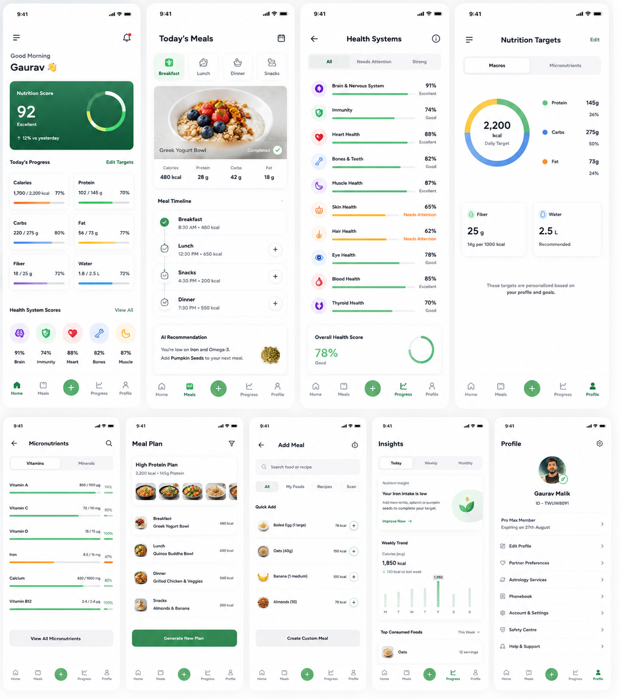

# 🎨 Design System & UI Guidelines

### Design Philosophy
The application is a **Nutrition Intelligence Platform and Food Logging App**. It combines seamless food logging—allowing users to effortlessly log meals directly from suggested meal plans slot-by-slot or search custom foods—with deep scientific intelligence. Every screen should help users understand where they currently stand, what they should do next, and why that recommendation matters. The interface should prioritize clarity, personalization, scientific credibility, and actionable insights over excessive visual effects. The application should feel closer to Apple Health, WHOOP, Oura, Levels, Linear, and Stripe Dashboard rather than a basic calorie counter.

---

### Overall Design Principles

#### Mobile First
- Design mobile-first with a minimum width of **375px**.
- Support responsive layouts for 375px, 390px, 414px, and 430px.
- Desktop should feel like an optimized extension of the mobile experience rather than a separate design.

#### Premium Visual Language
- The UI should look modern, elegant, and trustworthy.
- Avoid a "startup template" appearance.
- Focus on large whitespace, clear visual hierarchy, soft rounded corners, premium typography, elegant shadows, subtle gradients, minimal borders, and clean card layouts.
- The design should communicate confidence and simplicity.

#### Theme System
- Support Dark Theme (Default), Light Theme, and System Theme.
- Dark mode should feel luxurious with deep neutral backgrounds rather than pure black.
- Example palette:
  - Background: `#0B0F14`
  - Surface: `#141A22`
  - Card: `#1A222D`
  - Divider: `rgba(255,255,255,0.06)`
- Use glass effects sparingly only where they improve focus. Avoid making every card glassmorphic.

#### Glassmorphism Guidelines
- Use frosted glass only for: floating navigation, bottom sheets, modal dialogs, floating action buttons, quick actions.
- Avoid glass backgrounds for every card because readability is more important than visual effects.

#### Dashboard First Design
- The home screen should function as a personalized health command center.
- The first screen should immediately answer:
  - How healthy am I today?
  - What is left to complete?
  - What should I eat next?
  - Which nutrients require attention?
  - How close am I to today's goals?
- Prioritize meaningful insights instead of displaying large amounts of raw data.

#### Information Hierarchy
Every screen should follow this hierarchy:
1. Overall Nutrition Score
2. Today's Progress
3. Health System Scores
4. Remaining Nutrition Targets
5. Recommended Next Meal
6. Daily Meal Timeline
7. Insights & Suggestions
Users should understand their health status within 5 seconds of opening the app.

#### Dashboard Components
- Design premium cards for: Overall Nutrition Score, Daily Calories, Protein Progress, Carbohydrate Progress, Fat Progress, Fiber Progress, Water Intake, Health System Scores, Meal Timeline, Recommended Meal, Deficiency Alerts, Nutrition Insights.
- Use circular progress indicators, animated rings, and clean progress bars instead of tables.

#### Data Visualization
- The application is data-heavy. Prioritize beautiful visualizations: circular progress rings, radial health gauges, animated progress bars, weekly trend charts, nutrition completion graphs, meal timelines, achievement indicators.
- Avoid overwhelming the user with spreadsheets or dense tables.

#### Motion Design
- Animations should communicate state changes rather than exist for decoration.
- Examples: Dashboard cards fade and slide in sequentially, progress rings animate from 0% to the current value, progress bars fill smoothly, meal logging updates numbers in real time, health scores animate after calculations, recommendation cards transition elegantly.
- Animation duration: 150–300ms with smooth easing throughout.
- Avoid flashy or distracting animations.

#### Typography
- Headings: Inter Bold
- Body: Inter Regular
- Numbers: Tabular figures for consistency
- Maintain a clear visual hierarchy through font weight and spacing instead of excessive font sizes.

#### Color System
- Use a restrained color palette.
  - Primary: Emerald Green
  - Secondary: Electric Blue
  - Warning: Amber
  - Error: Red
  - Success: Green
  - Neutral: Slate Gray
- Never rely solely on color to communicate status. Always combine icons, labels, and percentages.

#### Card Design
- Cards should have: large padding, soft shadows, rounded corners (16–20px), minimal borders, consistent spacing.
- Cards should feel lightweight and premium.

#### Navigation
- Use a clean bottom navigation with five tabs in the order: Home, Insights, Health, Meals, Profile.
- Floating action button: Log Meal.
- The navigation should always remain accessible.

#### User Experience
- Every screen should answer one question: "What is the next best action the user should take?"
- Examples:
  - Instead of "Iron: 58%", Display: "Iron is below today's target. Adding 20g Pumpkin Seeds will increase completion to 86%."
  - Instead of "Protein: 102g", Display: "Only 28g protein remaining. Recommended: Greek Yogurt + Tofu Bowl."

#### Accessibility
- Support: high contrast, dynamic text scaling, screen readers, large touch targets, color-blind friendly charts.
- Never rely only on color.

#### Empty States
- Every empty state should guide the user.
- Example: "No meals logged. Start with breakfast to begin tracking today's nutrition."
- Avoid blank screens.

#### Premium Feel
- The application should feel: Intelligent, Calm, Scientific, Premium, Personalized, Trustworthy, Modern, Minimal.
- Avoid clutter, unnecessary icons, excessive gradients, or overly decorative elements.
- Every element should have a clear purpose.

#### Final Design Goal
- Design it as a **Nutrition Intelligence & Logging System** that enables seamless meal logging (from suggested plans or search) while helping users make better nutritional decisions through personalized insights, scientific optimization, and an elegant premium experience.
- Every screen should make users feel that the platform understands their health and proactively guides them toward achieving their goals.
