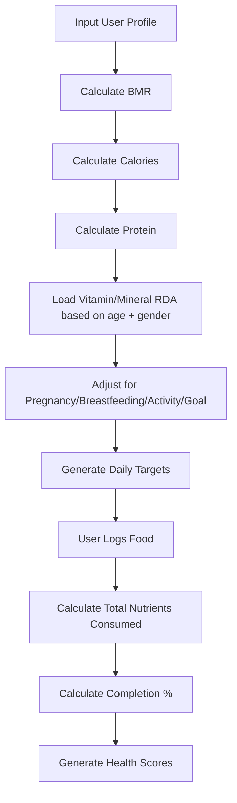

# Logic for Nutrition App

When developing a nutrition app, avoid hardcoding a single daily value for all users. Instead, use a personalised Daily Recommended Intake (DRI) based on the user’s profile.

The following logic is based on recommendations from organisations such as the U.S. National Academies (DRIs/RDAs/AIs) and can be adapted for your app.

---

## Step 1: Collect User Information

**User Profile Inputs:**
- Age
- Gender
- Height
- Weight
- Activity Level
- Pregnant? (Yes/No)
- Breastfeeding? (Yes/No)
- Diet Type
- Medical Conditions (optional)
- Goal (Weight loss / Maintenance / Muscle Gain)

---

## Step 2: Factors Affecting Daily Intake

| Factor | Affects |
|:---|:---|
| **Age** | Almost every vitamin & mineral |
| **Gender** | Iron, magnesium, zinc, calories |
| **Weight** | Protein |
| **Height** | Calories (via BMR) |
| **Activity Level** | Calories, protein |
| **Pregnancy** | Iron, folate, iodine, calcium, protein |
| **Breastfeeding** | Most nutrients increase |
| **Diet Type** | B12, iron, zinc, omega-3 attention |
| **Medical Conditions** | Optional future customization |

---

## Step 3: Calculate Calories First

Most nutrient recommendations do not directly depend on calories but macronutrients do.

### Calculate Basal Metabolic Rate (BMR)

**Male:**
`BMR = (10 × Weight in kg) + (6.25 × Height in cm) - (5 × Age) + 5`

**Female:**
`BMR = (10 × Weight in kg) + (6.25 × Height in cm) - (5 × Age) - 161`

### Activity Multiplier

| Activity | Multiplier |
|:---|:---|
| **Sedentary** | 1.2 |
| **Light** | 1.375 |
| **Moderate** | 1.55 |
| **Active** | 1.725 |
| **Athlete** | 1.9 |

**Total Daily Energy Expenditure (Calories):**
`Calories = BMR × ActivityMultiplier`

---

## Step 4: Protein Calculation

Protein requirements are not fixed.

| Profile | Protein Target |
|:---|:---|
| **Sedentary** | 0.8 g per kg of body weight |
| **Normal Active** | 1.0 g per kg of body weight |
| **Gym/Muscle Gain** | 1.4–2.0 g per kg of body weight |
| **Weight Loss** | 1.2–1.8 g per kg of body weight |
| **Older Adults (>65)** | 1.0–1.2 g per kg of body weight |

---

## Step 5: Fiber
**14g per 1000 kcal**

---

## Step 6: Fat
**20–35% of Calories**

---

## Step 7: Carbs
Remaining calories => `Calories - Protein Calories - Fat Calories = Carb Calories`

---

## Step 8: Vitamins & Minerals Master Reference Table

Below is a master reference table that you can use in your database. It is based on widely used RDA/AI values for healthy individuals. The values are daily targets, not upper limits.
**Units:** mg = milligrams, µg = micrograms

| Nutrient | Unit | Age Group | Male | Female | Pregnancy | Breastfeeding | Depends On |
|:---|:---:|:---:|:---:|:---:|:---:|:---:|:---|
| **Vitamin A** | µg | 1–3 | 300 | 300 | - | - | Age |
| | | 4–8 | 400 | 400 | - | - | Age |
| | | 9–13 | 600 | 600 | - | - | Age |
| | | 14–18 | 900 | 700 | 750 | 1200 | Age, Sex, Pregnancy |
| | | 19+ | 900 | 700 | 770 | 1300 | Age, Sex, Pregnancy |
| **Vitamin C** | mg | 1–3 | 15 | 15 | - | - | Age |
| | | 4–8 | 25 | 25 | - | - | Age |
| | | 9–13 | 45 | 45 | - | - | Age |
| | | 14–18 | 75 | 65 | 80 | 115 | Age, Sex |
| | | 19+ | 90 | 75 | 85 | 120 | Age, Sex |
| **Vitamin D** | µg | 1–70 | 15 | 15 | 15 | 15 | Age |
| | | 71+ | 20 | 20 | - | - | Age |
| **Vitamin E** | mg | 1–3 | 6 | 6 | - | - | Age |
| | | 4–8 | 7 | 7 | - | - | Age |
| | | 9–13 | 11 | 11 | - | - | Age |
| | | 14+ | 15 | 15 | 15 | 19 | Age |
| **Vitamin K** | µg | 1–3 | 30 | 30 | - | - | Age |
| | | 4–8 | 55 | 55 | - | - | Age |
| | | 9–13 | 60 | 60 | - | - | Age |
| | | 14–18 | 75 | 75 | 75 | 75 | Age |
| | | 19+ | 120 | 90 | 90 | 90 | Age, Sex |
| **Vitamin B1** (Thiamine) | mg | 1–3 | 0.5 | 0.5 | - | - | Age |
| | | 4–8 | 0.6 | 0.6 | - | - | Age |
| | | 9–13 | 0.9 | 0.9 | - | - | Age |
| | | 14–18 | 1.2 | 1.0 | 1.4 | 1.4 | Age, Sex |
| | | 19+ | 1.2 | 1.1 | 1.4 | 1.4 | Age, Sex |
| **Vitamin B2** (Riboflavin) | mg | 1–3 | 0.5 | 0.5 | - | - | Age |
| | | 4–8 | 0.6 | 0.6 | - | - | Age |
| | | 9–13 | 0.9 | 0.9 | - | - | Age |
| | | 14–18 | 1.3 | 1.0 | 1.4 | 1.6 | Age, Sex |
| | | 19+ | 1.3 | 1.1 | 1.4 | 1.6 | Age, Sex |
| **Vitamin B3** (Niacin) | mg | 1–3 | 6 | 6 | - | - | Age |
| | | 4–8 | 8 | 8 | - | - | Age |
| | | 9–13 | 12 | 12 | - | - | Age |
| | | 14–18 | 16 | 14 | 18 | 17 | Age, Sex |
| | | 19+ | 16 | 14 | 18 | 17 | Age, Sex |
| **Vitamin B5** (Pantothenic) | mg | 1–3 | 2 | 2 | - | - | Age |
| | | 4–8 | 3 | 3 | - | - | Age |
| | | 9–13 | 4 | 4 | - | - | Age |
| | | 14+ | 5 | 5 | 6 | 7 | Age |
| **Vitamin B6** | mg | 1–3 | 0.5 | 0.5 | - | - | Age |
| | | 4–8 | 0.6 | 0.6 | - | - | Age |
| | | 9–13 | 1.0 | 1.0 | - | - | Age |
| | | 14–18 | 1.3 | 1.2 | 1.9 | 2.0 | Age, Sex |
| | | 19–50 | 1.3 | 1.3 | 1.9 | 2.0 | Age |
| | | 51+ | 1.7 | 1.5 | - | - | Age, Sex |
| **Biotin (B7)** | µg | 1–3 | 8 | 8 | - | - | Age |
| | | 4–8 | 12 | 12 | - | - | Age |
| | | 9–13 | 20 | 20 | - | - | Age |
| | | 14–18 | 25 | 25 | 30 | 35 | Age |
| | | 19+ | 30 | 30 | 30 | 35 | Age |
| **Folate (B9)** | µg | 1–3 | 150 | 150 | - | - | Age |
| | | 4–8 | 200 | 200 | - | - | Age |
| | | 9–13 | 300 | 300 | - | - | Age |
| | | 14+ | 400 | 400 | 600 | 500 | Age |
| **Vitamin B12** | µg | 1–3 | 0.9 | 0.9 | - | - | Age |
| | | 4–8 | 1.2 | 1.2 | - | - | Age |
| | | 9–13 | 1.8 | 1.8 | - | - | Age |
| | | 14+ | 2.4 | 2.4 | 2.6 | 2.8 | Age |
| **Calcium** | mg | 1–3 | 700 | 700 | - | - | Age |
| | | 4–8 | 1000 | 1000 | - | - | Age |
| | | 9–18 | 1300 | 1300 | 1300 | 1300 | Age |
| | | 19–50 | 1000 | 1000 | 1000 | 1000 | Age |
| | | 51–70 | 1000 | 1200 | - | - | Age, Sex |
| | | 71+ | 1200 | 1200 | - | - | Age |
| **Iron** | mg | 1–3 | 7 | 7 | - | - | Age |
| | | 4–8 | 10 | 10 | - | - | Age |
| | | 9–13 | 8 | 8 | - | - | Age |
| | | 14–18 | 11 | 15 | 27 | 10 | Age, Sex |
| | | 19–50 | 8 | 18 | 27 | 9 | Age, Sex |
| | | 51+ | 8 | 8 | - | - | Age |
| **Magnesium** | mg | 1–3 | 80 | 80 | - | - | Age |
| | | 4–8 | 130 | 130 | - | - | Age |
| | | 9–13 | 240 | 240 | - | - | Age |
| | | 14–18 | 410 | 360 | 400 | 360 | Age, Sex |
| | | 19–30 | 400 | 310 | 350 | 310 | Age, Sex |
| | | 31+ | 420 | 320 | 360 | 320 | Age, Sex |
| **Potassium** (AI) | mg | 1–3 | 2000 | 2000 | - | - | Age |
| | | 4–8 | 2300 | 2300 | - | - | Age |
| | | 9–13 | 2500 | 2300 | - | - | Age |
| | | 14+ | 3400 | 2600 | 2900 | 2800 | Age, Sex |
| **Zinc** | mg | 1–3 | 3 | 3 | - | - | Age |
| | | 4–8 | 5 | 5 | - | - | Age |
| | | 9–13 | 8 | 8 | - | - | Age |
| | | 14–18 | 11 | 9 | 12 | 13 | Age, Sex |
| | | 19+ | 11 | 8 | 11 | 12 | Age, Sex |
| **Phosphorus** | mg | 1–3 | 460 | 460 | - | - | Age |
| | | 4–8 | 500 | 500 | - | - | Age |
| | | 9–18 | 1250 | 1250 | 1250 | 1250 | Age |
| | | 19+ | 700 | 700 | 700 | 700 | Age |
| **Selenium** | µg | 1–3 | 20 | 20 | - | - | Age |
| | | 4–8 | 30 | 30 | - | - | Age |
| | | 9–13 | 40 | 40 | - | - | Age |
| | | 14+ | 55 | 55 | 60 | 70 | Age |
| **Iodine** | µg | 1–3 | 90 | 90 | - | - | Age |
| | | 4–8 | 90 | 90 | - | - | Age |
| | | 9–13 | 120 | 120 | - | - | Age |
| | | 14+ | 150 | 150 | 220 | 290 | Age |
| **Omega-3** (AI) | g | 1–3 | 0.7 | 0.7 | - | - | Age |
| | | 4–8 | 0.9 | 0.9 | - | - | Age |
| | | 9–13 | 1.2 | 1.0 | - | - | Age, Sex |
| | | 14–18 | 1.6 | 1.1 | 1.4 | 1.3 | Age, Sex |
| | | 19+ | 1.6 | 1.1 | 1.4 | 1.3 | Age, Sex |

### Adjustments for Pregnancy & Breastfeeding

| Condition | Nutrient | Increase By |
|:---|:---|:---|
| **Pregnancy** | Protein | +25g |
| | Iron | target 27mg |
| | Folate | target 600µg |
| | Calcium | target 1000–1300mg |
| | Iodine | target 220µg |
| | Vitamin C | target 85mg |
| | Vitamin B12 | target 2.6µg |
| **Breastfeeding**| Protein | +25g |
| | Vitamin A | target 1300µg |
| | Vitamin C | target 120mg |
| | Iodine | target 290µg |
| | Vitamin B12 | target 2.8µg |

---

## Step 9: Micronutrient Completion %

Once foods are logged:

`Completion % = (Consumed / Daily Goal) × 100`

---

## App Algorithm Flow

---

## Practical Implementation

For most users, you only need these inputs to generate personalized targets:

1. **Required:** Age, sex, weight, height, activity level.
2. **Conditional:** Pregnancy and breastfeeding (if applicable).
3. **Goals:** Weight loss, maintenance, or muscle gain (mainly affects calories and protein).

Use standard RDA/AI tables for vitamins and minerals based on age and sex, and calculate calories and protein dynamically. This approach is accurate, easy to maintain, and aligns with established nutrition guidelines.
